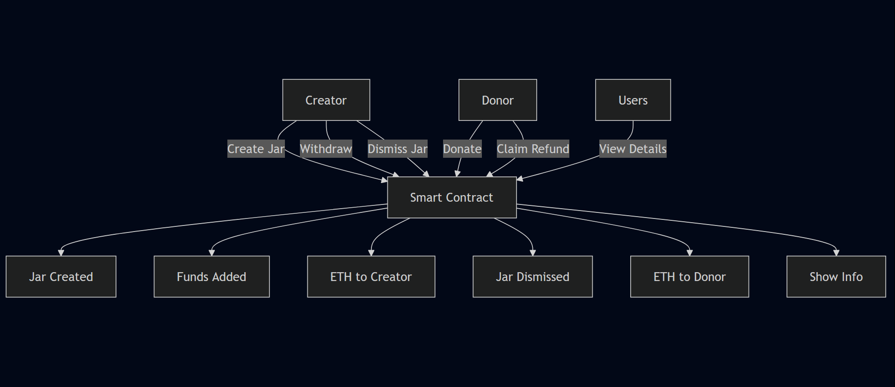

# 📘 EventCreation Smart Contract – Project Documentation

## Introduction : 

The `JarCreation` smart contract is a decentralized fundraising system built on the Ethereum blockchain using Solidity. It allows individuals to create digital "jars" or virtual donation pools with a specific goal or cause in mind. Other users can contribute ETH to these jars, and once the target amount is reached, the creator can withdraw the funds. This system brings transparency, control, and trust to fundraising by using the immutable and auditable nature of blockchain technology. In this project Event is referred as Jar . 

## Why This Is Helpful & Needed

In a world where crowdfunding and donations are increasingly done online, there's always the challenge of trust, mismanagement of funds, or opaque processes. The `JarCreation` contract solves this by making the donation process entirely transparent and verifiable. Anyone can see the status of a fundraising jar, how much has been raised, and whether the creator has withdrawn the funds. This makes it ideal for various real-life scenarios such as:

* **Medical Emergencies**: Individuals facing serious health issues can create jars for surgeries, treatments, or urgent care.
* **Community Support**: Local communities or NGOs can create jars for relief funds, education, infrastructure, etc.
* **Event Fundraising**: College events, hackathons, social drives, and awareness campaigns can use this to transparently raise funds from participants and sponsors.
* **Personal Goals**: People can even use it for personal ventures like building projects, travel with a cause, or skill development.

Moreover, the smart contract allows donors to reclaim their money if a campaign is dismissed before its goal is met, thus protecting donor interests. It promotes decentralized financial coordination without intermediaries, and ensures security through Ethereum’s underlying protocols.

## Features

The contract enables the following key functionalities:

* **Create Jars**: Any user can create a new fundraising campaign (jar) by specifying its name, cause, and target amount.
* **Donate ETH**: Contributors can easily donate to active jars using the `donateToJar` function.
* **Withdraw Funds**: When the target is met, the jar creator can withdraw the collected funds.
* **Dismiss Jars**: If the creator decides to cancel the campaign before reaching the goal, the jar can be dismissed.
* **Claim Refunds**: In case of a dismissed jar, donors can claim refunds equivalent to their contributions.
* **Real-Time Transparency**: Each action emits an event so users can track activity (creation, donation, withdrawal, dismissal, refund) via blockchain explorers.

## Technical Summary

Each jar is represented using a `struct` that stores the campaign details such as name, creator address, cause, fundraising goal, current amount collected, and status flags for withdrawal or dismissal. A mapping tracks how much each donor has contributed to each jar. The system ensures that a jar cannot be withdrawn or dismissed multiple times and that donors cannot over-contribute beyond the jar’s target.

Access control is enforced so that only the creator of a jar can withdraw or dismiss it. This prevents unauthorized manipulation. The contract also handles edge cases like overfunding, double-withdrawals, and donations to dismissed or completed jars.

## Events & Error Handling

The contract uses Solidity events like `jarCreated`, `fundDeposited`, `fundWithdrawn`, `refundClaimed`, and others to track changes and notify off-chain systems or front-end UIs. Additionally, custom error messages like `jarDoesNotExist` and `withdrawFailed` make debugging and user feedback cleaner.

## Real-World Example

Imagine an accident victim's family creates a fundraising jar for ₹3 lakhs (equivalent ETH) to pay for surgery. Friends, family, and even anonymous donors from the internet can contribute directly using MetaMask. As the funds grow and reach the goal, the family can withdraw them instantly without needing a bank or a centralized crowdfunding platform. If the campaign is withdrawn early for any reason, contributors can get their money back—all secured and processed automatically through the blockchain.
---

---

Here’s a **concise summary of each function** in the `JarCreation` smart contract:

---

### 🔧 Function Summaries

* **`createJar(string _name, string _cause, uint256 _targetAmount)`**
   Allows a user to create a new fundraising jar by providing a name, cause, and target amount. Initializes the jar with default values and stores it.

* **`donateToJar(uint256 _jarId, uint256 _amountDeposited)`**
   Lets users donate ETH to a specific jar. Updates the jar’s current amount and logs the donor's contribution. Emits an event if the target is reached.

* **`withdrawJarAmount(uint256 _jarId, uint256 _withdrawnAmount)`**
   Enables the jar creator to withdraw the collected funds if the jar has reached or partially reached its goal. Prevents double withdrawals.

* **`getJarCount()`**
   Returns the total number of jars created. Helpful for iterating over all existing jars on the frontend.

* **`getJarDetails(uint256 _jarId)`**
   Provides public details of a specific jar including name, creator, cause, target, current amount, and withdrawal status.

* **`getDepositDetails(uint256 _jarId, address _donor)`**
   Returns how much a donor has contributed to a jar, as well as their total created and withdrawn amounts across the contract.

* **`getJarCreator(uint256 _jarId)`**
   Returns the address of the creator of a specified jar.

* **`getJarCurrentAmount(uint256 _jarId)`**
   Fetches the current amount of ETH collected in a particular jar.

* **`dismissJar(uint256 _jarId)`**
   Allows the creator to cancel their own jar before withdrawal. Once dismissed, donations cannot be made and refunds become possible.

* **`claimJarsRefund(uint256 _jarId)`**
   Lets a donor reclaim their donation if the jar was dismissed and not withdrawn. Transfers their donated amount back to them.

---

